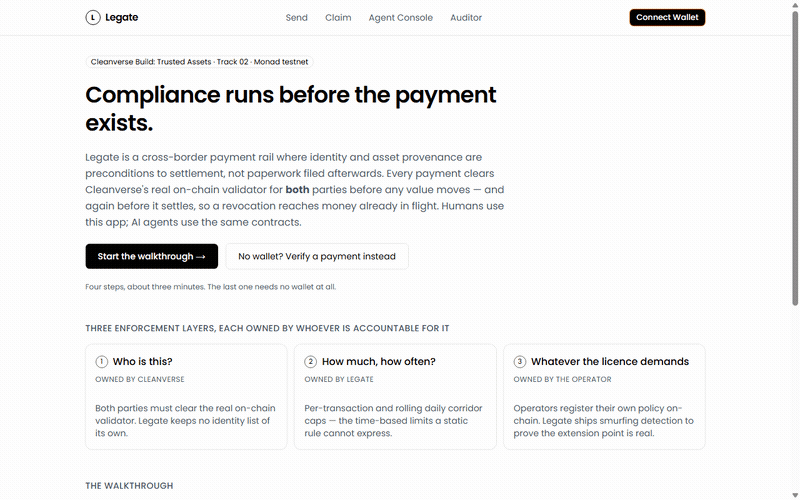

# Legate

**The compliant payment rail for humans and AI agents.**

[](./contracts/test) [](./contracts/test) [](https://monad.xyz) [](./LICENSE)

Built for **Cleanverse Build: Trusted Assets** — Track 02 (DeFi / Compliant DeFi).

`LegateEscrow` is a **permissioned pool registered with Cleanverse's validator under a real `RuleV2`**. CVI is the protocol's entry condition — both counterparties must clear `complianceVerify()` on-chain before the pool accepts or releases anything, and again independently at settlement. CVA is the only asset it moves. Every payment carries a hash-anchored Travel Rule proof. Humans use a web app; AI agents use the identical contracts through **x402** and **MCP**, spending under caps that live in contract storage, not in a prompt.

In July 2026 Uniswap shipped [Permissioned Pools](https://blog.uniswap.org/introducing-permissioned-pools-on-uniswap-v4), moving compliance into the AMM's execution layer instead of a frontend gate. **Legate is that thesis applied to payments — and it adds the agent.**

**Live app:** https://legate-cleanverse.vercel.app — a four-step walkthrough; the last step needs no wallet.

Corridor: **Malaysia ↔ Philippines** — live-verified against Cleanverse's real Fiat Ramp (see [`DECISIONS.md`](./DECISIONS.md) for why Singapore↔India, the original target, was dropped after the sandbox proved SGD/INR aren't supported there).



---

## Proof, not claims

Every number below is independently checkable in minutes — none of it is a description of intent.

| Claim | How to check it yourself |
|---|---|
| **Live on Monad testnet**, not just "ready to deploy" | `LegateEscrow` at [`0x98b1699a03c107293637aacbde194d29023183b5`](https://testnet.monadexplorer.com/address/0x98b1699a03c107293637aacbde194d29023183b5) — registered with Cleanverse's real validator, `tx_hash` [`0xa3bc05e6…7fbc6d5e`](https://testnet.monadexplorer.com/tx/0xa3bc05e625a97181f480b02cc63229ee1e87b33df72c60e6b94bd7aa60ad5c42). `complianceVerify()` resolves for real against it right now. |
| **108/108 contract tests passing, 100% line/branch/function coverage — on all 6 contracts**, not the usual one or two | `cd contracts && forge test && forge coverage --report summary` |
| **A working reentrancy exploit and a mandate-hijack exploit, both proven before their fixes existed** | `contracts/test/LegateEscrow.t.sol`'s `MaliciousReentrantToken` test, `AgentMandate.t.sol`'s hijack tests — real proof-of-concept attacks, not asserted-safe comments |
| **An invariant campaign, not just unit tests** | `contracts/test/LegateEscrow.invariant.t.sol` — 8,192 real `initiate`/`settle` calls per run checking `totalEscrowed` accounting never drifts. Deliberately falsified before being trusted: the real accounting line was broken on purpose mid-build, the test caught it with an auto-shrunk 2-call repro, then the code was restored — see [`DECISIONS.md`](./DECISIONS.md). |
| **Every refusal is a real contract revert**, never a script pretending | `bash demo/run-demo.sh` — each "REFUSED ON-CHAIN" line asserts the exact custom-error selector; a generic failure fails the run instead of printing a convincing fake |
| **The web app actually works against the live deployment**, not a staged demo | Send/Claim's Fiat Ramp quotes are real, live Cleanverse Gateway calls — try it: 100 MYR quotes ~22 USDC, 100 USDC quotes ~5,700 PHP, both change with the market |
| **Zero static-analysis findings left unresolved** | Full Slither pass, every finding triaged — real fixes applied, remaining flags documented as false positives with the specific reasoning, not silently suppressed (see `DECISIONS.md`) |
| **CVI/CVA aren't a login screen** | 4 distinct on-chain enforcement moments, 6 `complianceVerify()` call sites: escrow-initiate, mandate-creation, mandate-execute (both parties), and settlement — re-checked independently, not gated once and trusted forever |

---

## Why Cleanverse, not around it

Remove A-Pass (CVI) and counterparties are anonymous — the rail becomes an ordinary token bridge, and no licensed remittance operator could put a customer on it. Remove A-Token (CVA) and the asset carries no provenance or transfer rules. Remove the on-chain validator and Travel Rule report and there's no pre-transaction compliance check, no audit trail. **Strip Cleanverse out and Legate isn't degraded — it stops being a compliant rail at all.** That's the necessity test this project holds itself to; see `PRD.md` §1.

## Architecture

```
  HUMAN DOOR                        AGENT DOOR
  Web app (Send / Claim)            x402 middleware  +  MCP server
        │                                   │
        └────────────────┬──────────────────┘
                          ▼
        LEGATE POLICY ENGINE  (backend — informational only)
        • Resolve A-Pass for both parties: POST /query_apass
        • Preview the on-chain compliance check off-chain (same logic, no gas)
        • Run ComplianceGate.previewCheck — all three enforcement layers as a
          view call, so the preview cannot disagree with the contract
        • Return a quote (fee, FX estimate) — never a cryptographic attestation
          the contracts trust blindly
                          ▼
        CONTRACTS ON MONAD  (the actual source of truth)
        • LegateEscrow      — payment lifecycle, the only holder/mover of A-Token
        • AgentMandate      — the MODULE: initiates without holding a key,
                              bounded by caps that live in storage
        • ComplianceGate    — the GUARD: can only refuse, never initiate
        • CVIRegistryMirror — active revocation monitor (defense-in-depth)
        • TravelRuleAnchor  — hash-anchors Cleanverse's real compliance report
                          ▼
        THE GUARD RUNS THREE LAYERS, EACH OWNED BY WHOEVER IS ACCOUNTABLE
        1. Cleanverse validator   WHO is this?          → Cleanverse owns it
        2. ComplianceGate caps    HOW MUCH / HOW OFTEN? → Legate owns it
        3. IComplianceRule[]      the operator's own    → THE OPERATOR owns it
           └─ StructuringRule: catches smurfing, which neither
              layer 1 (static) nor layer 2 (aggregate) can see
                          ▼
        AUDIT LAYER
        • Immutable on-chain event log • Walletless /receipt/:id permalinks
```

**Why there's no attestation-signing step.** An earlier design had the backend issue a signed EIP-712 attestation the contracts would trust. It's unnecessary: `complianceVerify()` is a real, public, on-chain view function the contracts call directly and independently, and `AgentMandate`'s spend caps are on-chain state, not an off-chain promise. Even a compromised backend cannot cause a non-compliant transfer — the chain re-verifies everything itself. The backend's only job is a fast, gas-free preview of what the chain will do anyway.

## Cleanverse capability integration

| Capability | Depth | How |
|---|---|---|
| **CVI (A-Pass)** | Deep | The protocol's **entry condition**, checked on-chain at 4 distinct moments — escrow-initiate, mandate-creation, mandate-execute (both sender and recipient), and settlement — not a single gate-once check. Revocation reaches funds already in flight: a party revoked *between* escrow and settlement is caught independently at settlement, no poller or admin needing to notice in time. Real tier/subTier fields (`min_tier: 30`, countries `["MY","PH"]`) set the corridor's registered floor, and — genuinely new, not just displayed — a connected principal's real live tier now drives graduated spend-cap *suggestions* in the Agent Console (tier 50+, Legate's own "verified institutional/agent-operator" tier, gets meaningfully higher suggested caps than the corridor floor). Honestly scoped: there's no trustless way to read an *individual user's* tier on-chain in Cleanverse's current interface (only a pool's own registered floor via `getRulesV2`), so this stays an off-chain UX signal, not fabricated on-chain enforcement — see `DECISIONS.md`. |
| **CVA (A-Token)** | Deep | The *only* asset `LegateEscrow` accepts. Transfer rules are a real on-chain `RuleV2` enforced by the A-Token's own transfer hook — not API-side gating. **Note:** as of 2026-08-09, Cleanverse's own API returned two *different* Monad aUSDC addresses within the same day (`0xfA96…1026` at 18 decimals, then `0xaC08…f20D` at 6 decimals, stable on re-check, and the one actually deployed against) — both real, both live on-chain. Caught by a live test, verified independently against Monad RPC each time, written up in full in `DECISIONS.md`. The deploy script doesn't hardcode the address — it's an env-var override with a loud re-verify-before-deploying reminder — and caps read the token's real `decimals()` live, so either outcome is handled correctly. |
| **CCP (on-chain validator)** | Deep | `IAPassComplianceValidator.complianceVerify(pool, address)` called directly, synchronously, on-chain — no off-chain bridge. Plus `download_travel_rule`, hash-anchored post-settlement. |
| **Playground** | Partial, honestly framed | Real, but a learning/reference tool, not a rule-design tool — `RuleV2` is configured directly against the validator, not "designed in Playground." No demo footage claimed here because there's nothing to film. |
| **API/SDK** | Deep | No SDK exists in Cleanverse's docs (raw cURL/JSON only) — Legate ships its own typed TypeScript client scoped to exactly the endpoints the product uses. |
| **Gateway (Fiat Ramp)** | Deep, one disclosed gap | Real MYR/PHP on/off-ramp, both legs wired and live-tested against the production deployment (not just the sandbox) — real quotes, real fees, both directions. **Live-verified gap:** despite the docs listing `monad` as a supported ramp settlement network, the sandbox does not currently route ramp settlement onto Monad — confirmed via direct testing (`network:"base"` succeeds, `network:"monad"` fails for every input tried). Send/Claim's fiat legs use the real, verified-working `base` network; getting funds onto Monad as aUSDC is a separate step this build does not fake. Full finding in `DECISIONS.md`. |
| **Clean Payment Rails** | Deep | Escrow settlement built on standard A-Token transfers; a real 50bps settlement fee, not just a narrative revenue line. |
| **Agent Skill Framework** | Deep, built by Legate | Nothing like this exists in Cleanverse's docs. `AgentMandate.sol` is Legate's own: A-Pass-bound principal verification, on-chain spend caps, immutable audit trail. |

No claim in this table lacks a verified endpoint, address, or interface behind it — every finding above was reached by a real API call or a real on-chain read, logged with its date in [`DECISIONS.md`](./DECISIONS.md), not asserted from the docs alone.

## Quick start

```bash
git clone --recurse-submodules <repo-url> legate
cd legate
```

The `--recurse-submodules` matters — Foundry dependencies (OpenZeppelin v5.7.0, forge-std v1.16.2) are pinned submodules, and a plain clone leaves `contracts/lib/` empty and `forge build` failing. If you already cloned without it: `git submodule update --init --recursive`.

Fastest way to see the whole stack actually work, with no Cleanverse credentials and no testnet funds:

```bash
cd backend && npm install && cd ..
bash demo/run-demo.sh          # all four demo scenes, end to end, ~40 seconds
```

That walks PRD §6's four scenes against real contracts on a local chain: a settled payment, a refusal shown beside a positive control, a revocation reaching funds already in escrow, and an AI agent hitting its on-chain spend cap. **Every refusal it prints is decoded from a real contract revert** — the script asserts the exact custom error selector, so a generic failure fails the run rather than passing as a convincing-looking "BLOCKED". In local mode Cleanverse's validator is mocked (it lives on Monad and a local chain can't reach it) and the script says so on screen; `MODE=monad bash demo/run-demo.sh` runs the same scenes fully unmocked against a real deployment.

Or run the whole real deploy chain in one command against a funded wallet: `bash scripts/go-live.sh` — this is exactly what stood up the live testnet deployment above; see the script's own header for what it does and doesn't automate.

## Repository layout

```
contracts/   Foundry project — 6 contracts (5 rail + 1 pluggable rule
             module), 2 interfaces, 108 tests including a fuzzed
             invariant campaign (see below)
backend/     Node/TypeScript — Cleanverse REST client, policy engine, x402
             middleware, MCP server (6 tools), REST API for the web app
web/         Next.js 16 — Send, Claim, Agent Console, Auditor, and the
             walletless /receipt/:id permalink
scripts/     go-live.sh — the real Monad deploy, collapsed to one command
PRD.md       Full product spec
DECISIONS.md Running decision log — every verified fact, every bug found
             and fixed, dated
```

## Smart contracts

Six contracts — five that make up the rail, plus one pluggable rule module that exists to prove the rail is extensible. Kept separate on purpose — matches Cleanverse's own Factory/Pool separation pattern and lets a judge audit one small, single-responsibility contract at a time.

- **`LegateEscrow`** — the payment lifecycle (`Escrowed → Settled | Frozen | Refunded`). Accepts only the A-Token. Checks-effects-interactions on every state-changing function that moves funds; `ReentrancyGuard` where it matters (proven by a real reentrancy-attack test, not just asserted). If a recipient never claims, `reclaimExpired()` lets the **original sender** take their own funds back after a 30-day on-chain claim window — no admin in the loop, which is the difference between a remittance rail and a place money goes to get stuck.
- **`ComplianceGate`** — the guard. Three layers, each owned by whoever is accountable for it: Cleanverse's validator answers *who*, this contract answers *how much and how often*, and registered `IComplianceRule` modules answer whatever the operator's own licence demands. Structurally this is Safe's guard — it can only refuse, never initiate.
- **`IComplianceRule` + `StructuringRule`** — the extension point, and one module proving it isn't decorative. An operator registers their own policy on-chain without forking anything Legate has already audited. `StructuringRule` detects smurfing — one large transfer split into many small ones — which *neither* other layer can express: `RuleV2` is static and judges parties, not patterns over time, and a pair moving 20 × 500 aUSDC never trips a 10,000 per-transaction cap. That gap is exactly why the extension point exists.
- **`AgentMandate`** — the module. On-chain spend caps for an AI agent, scoped to a principal who must itself hold a valid A-Pass. A module can *initiate* a payment without holding the principal's key; the guard can only *refuse*. An agent needs both halves — this is the split Safe proved at $60B+ secured, ~130M transactions in a single recent quarter. Cap-exceeded and non-compliant-recipient reverts surface as structured x402 refusal codes.
- **`CVIRegistryMirror`** — active revocation monitor, driven by a real background poller service (`backend/src/poller/`, see below). Defense-in-depth: settlement independently reverts on revocation even without it.
- **`TravelRuleAnchor`** — the single canonical anchor point for a payment's Travel Rule proof, cross-checked against `LegateEscrow`'s real on-chain state (rejects anchoring a payment that isn't genuinely Settled) rather than trusting the caller's claim. Anchoring is a server-signed, `ANCHOR_ROLE`-gated action by design — there is deliberately no public "trigger anchoring" control anywhere in the product, since that authority belongs to whoever operates the corridor, not to an arbitrary visitor.

```bash
cd contracts
forge test               # 108/108 passing — unit tests, fuzz tests, an invariant
                          # campaign, and a proven reentrancy + mandate-hijack exploit
forge coverage --report summary   # 100% line/branch/function on all 6 contracts
forge build
```

**Static analysis:** a full Slither pass with every finding individually triaged — real issues fixed, remaining flags documented as false positives with the specific reasoning (e.g. `arbitrary-send-erc20` on a `CALLER_ROLE`-gated function is by design), not silently suppressed. Full trail in `DECISIONS.md`.

**Honest disclosure:** the hackathon build uses a single admin EOA for `ADMIN_ROLE`. Migrating to a Safe multisig before any real-money pilot is a stated `PRD.md` §11 roadmap item, not hidden.

## Backend

```bash
cd backend
npm install
npm run build
npm run lint          # ESLint, 0 findings
npm test              # includes live tests against the real Cleanverse sandbox
```

Includes an optional **revocation poller** (`src/poller/revocation-poller.ts`) for Scene 3: watches every wallet with an open payment or active mandate, checks real A-Pass status via Cleanverse's REST API, and calls the real on-chain `reportRevocation()`/`reportReactivation()` on a detected transition. Starts automatically if `CVI_REGISTRY_MIRROR_ADDRESS` and `POLLER_PRIVATE_KEY` are set; the backend runs fine without it (the chain's own independent re-check at settlement is the real safety net regardless — see `PRD.md` §3). Deliberately left unconfigured on the live production deployment (stateless serverless hosting can't run a continuous background loop) — stated plainly, not hidden, in `DECISIONS.md`.

Real, working end-to-end proofs (not mocks) live in `backend/test/`:
- `e2e-x402-local.sh` — deploys real contracts to a local chain, drives the x402 HTTP endpoints for real, proves cap-exceeded and non-compliant refusals decode to the exact on-chain revert reason, and walks a real payment through the full sender-reclaim path (refused pre-window, refused for a non-sender, honoured in full afterwards) — which also catches ABI drift between the backend's hand-written signatures and the deployed bytecode.
- `e2e-mcp-local.sh` + `mcp-e2e-client.ts` — a real MCP client (`@modelcontextprotocol/sdk`) driving the real MCP server as a real child process over real stdio JSON-RPC.
- `e2e-poller-local.sh` + `poller-e2e-client.ts` — proves the revocation poller indexes real on-chain events and behaves correctly across poll ticks; the full "real A-Pass freeze triggers a real on-chain reportRevocation()" leg needs the real Cleanverse `api-key` and is skipped honestly (not faked) when that credential isn't available in the environment.
- `cleanverse-client.live.test.ts` — live tests against the real Cleanverse UAT sandbox.

## Web app

```bash
cd web
npm install
cp .env.local.example .env.local   # fill in contract addresses + RPC URL
npm run dev
```

Five views: **Send**, **Claim** (recipients claim what was sent to them; senders reclaim what was never picked up), **Agent Console** (create/revoke on-chain mandates, with real-tier-informed cap suggestions), **Auditor** (look up any payment, real Travel Rule proof, export), and `/receipt/:paymentId` — a walletless, server-rendered permalink for asynchronous judging.

State-changing actions (approve, send, claim, create mandate) are always signed by the user's own connected wallet. The web app never custodies funds or relays these transactions.

## MCP tools (for AI agents)

`verify_recipient`, `get_quote`, `send_payment`, `check_mandate`, `get_audit_report`, `list_transactions` — a real MCP server any MCP-speaking agent (Claude or otherwise) can connect to. Refusals come from the real on-chain contract's revert, decoded via `Interface.parseError()` — never the agent's own say-so, and not something a compromised backend could fake.

## x402 (for HTTP-native agent payments)

`GET /pay/:invoiceId` returns HTTP 402 with payment + compliance requirements; `POST /pay/:invoiceId` submits the real on-chain `AgentMandate.execute()` call and returns either a settlement receipt or a structured, contract-derived refusal.

## Deployment status

**Live on Monad testnet.** `LegateEscrow` at `0x98b1699a03c107293637aacbde194d29023183b5`, registered with Cleanverse's real validator (`tx_hash: 0xa3bc05e625a97181f480b02cc63229ee1e87b33df72c60e6b94bd7aa60ad5c42`) — `complianceVerify()` resolves for real. Backend live at `https://legate-cleanverse-backend.vercel.app`; web app at `https://legate-cleanverse.vercel.app`. Full address set and deploy trail in `DECISIONS.md`.

## Credits

Built on [Cleanverse](https://cleanverse.com)'s real A-Pass, A-Token, and on-chain compliance validator. Agent-payment standards: [x402](https://github.com/coinbase/x402), [Model Context Protocol](https://modelcontextprotocol.io). Contracts: [OpenZeppelin](https://openzeppelin.com). Chain: [Monad](https://monad.xyz) testnet.

## License

MIT — see [`LICENSE`](./LICENSE).

---

Built by **Chancery Labs**.
